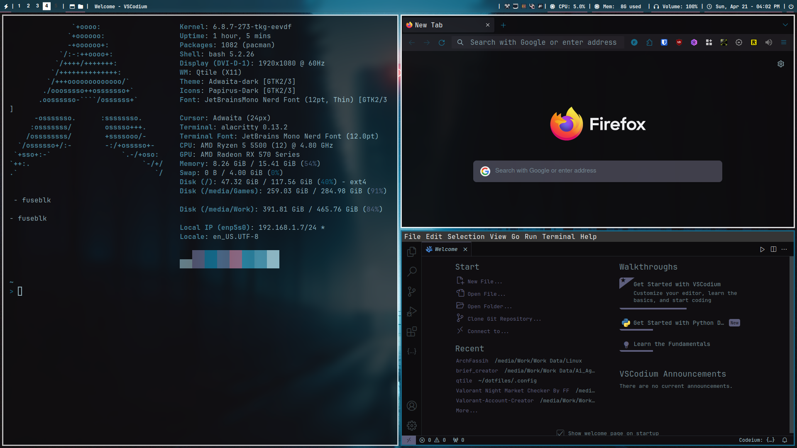
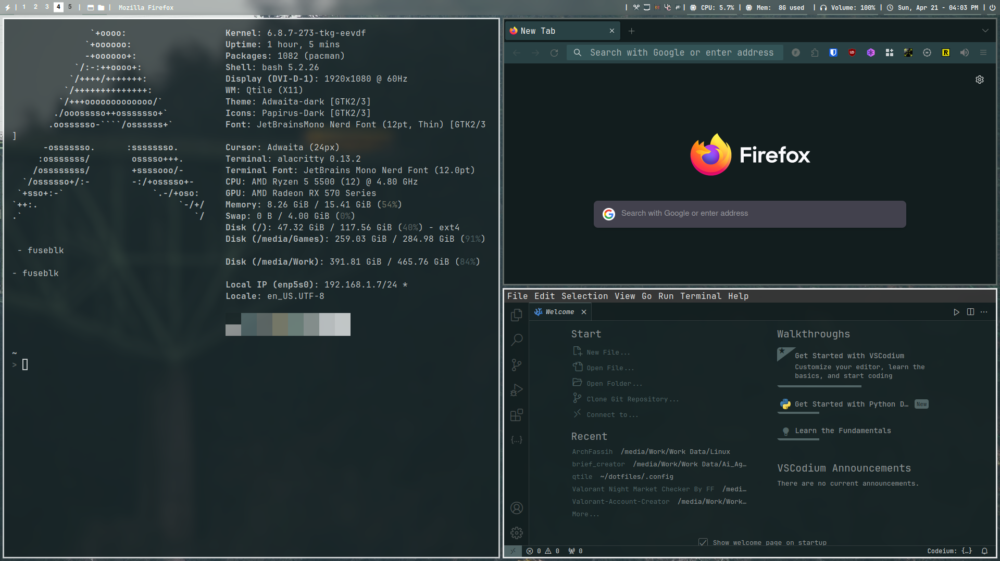

# My Arch Linux Setup Installation Script

Just a script to get my setup working in just a few prompts.

## Images in Action





## Features

- Install Window Manager (Qtile) and Xorg
- Install AUR package manager (yay)
- Install Wayland
- Install essential programs and utilities
- Set FSTAB permissions
- Setup fast mirrors
- Install apps before adding dotfiles
- Setup dotfiles
- Install themes and appearance-related packages
- Install sound utilities
- Install important softwares (CoreCtrl, Kodi, Flameshot, etc.)
- Setup gaming environment (Steam, Lutris, Wine, etc.)

## Usage

1. Clone the repository:

```bash
git clone https://github.com/fassihfayyaz/archfassih.git
```

2. Navigate to the project directory:

```bash
cd archfassih
```

3. Make the script executable:

```bash
4. chmod +x install.sh
```

5. Run the script:

```bash
./install.sh
```
Follow the prompts and respond with y or n to install or skip each section.
